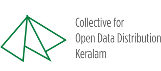

# covid19kerala.info Data



### Covid19Kerala.info Data: A collective open dataset of COVID-19 outbreak in the south Indian state of Kerala 

 Covid19Kerala.info-Data is a consolidated multi-source open dataset of metadata from the COVID-19 outbreak in the Indian state of Kerala. It is created and maintained by volunteers of ‘Collective for Open Data Distribution-Keralam’ (CODD-K), a nonprofit consortium of individuals formed for the distribution and longevity of open-datasets. Covid19Kerala.info-Data covers a set of correlated temporal and spatial metadata of SARS-CoV-2 infections and prevention measures in Kerala. Static releases of this dataset snapshots are manually produced from a live database maintained as a set of publicly accessible Google sheets. This dataset is made available under the Open Data Commons Attribution License v1.0 (ODC-BY 1.0). 

#### Temporal and Spatial Coverage 

This dataset covers COVID-19 outbreak and related data from the state of Kerala, India, from January 31, 2020 till the date of the publication of this manuscript. The dataset shall be maintained throughout the entirety of the COVID-19 outbreak.  

The spatial coverage of the data lies within the geographical boundaries of the Kerala state which includes its 14 administrative subdivisions. The state is further divided into Local Self Governing (LSG) Bodies. Reference to this spatial information is included on appropriate data facets. Available spatial information on regions outside Kerala was mentioned, but it is limited as a reference to the possible origins of the infection clusters or movement of the individuals.  

#### Longevity and Provenance 

The dataset snapshot releases are published and maintained in a designated GitHub repository [3] maintained by CODD-K team. Periodic snapshots from the live database will be released at regular intervals. The GitHub commit logs for the repository will be maintained as a record of provenance, and archived repository will be maintained at the end of the project lifecycle for the longevity of the dataset.

#### Data Stewardship 

CODD-K expects all administrators, managers, and users of its datasets to manage, access, and utilize them in a manner that is consistent with the consortium’s need for security and confidentiality and relevant legal frameworks within all geographies, especially Kerala and India. As a responsible steward to maintain and make this dataset accessible— CODD-K absolves from all liabilities of the damages, if any caused by inaccuracies in the dataset. 

#### License 

This dataset is made available by the CODD-K consortium under ODC-BY 1.0 license. The Open Data Commons Attribution License (ODC-By) v1.0 ensures that users of this dataset are free to copy, distribute and use the dataset to produce works and even to modify, transform and build upon the database, as long as they attribute the public use of the database or works produced from the same, as mentioned in the citation below. 

```
Covid19Kerala.info. 2020. Version X.Y.Z.   
Retrieved from Covid19Kerala.info.   
Accessed YYYY-MM-DD. https://covid19Kerala.info. 

In text: (Covid19Kerala.info data, 2020)
```


#### Disclaimer 

Covid19Kerala.info-Data is provided under the ODC-BY 1.0 license as-is. Though every attempt is taken to ensure that the data is error-free and up to date, the CODD-K consortium do not bear any responsibilities for inaccuracies in the dataset or any losses—monetary or otherwise—that users of this dataset may incur. 
